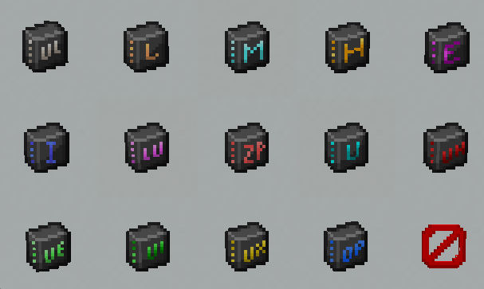

# GTM Extended Features
Addon for GTCEu Modern (Minecraft 1.20.1, Forge) that adds "QoL" multiblocks based on existing GTCEu machines, with extra benefits (parallels, laser hatches, compressed recipes) at the cost of more resources to build. Designed for Gregtech-style progression modpacks that want to ease bottlenecks without breaking the original balance

# What does this addon offers?
## New Multiblocks
| Abbreviation |          Machine          | Description                                                                                                                                                                                         |
|:------------:|:-------------------------:|-----------------------------------------------------------------------------------------------------------------------------------------------------------------------------------------------------|
|     RAM      | Robust Alloy Materializer | Alloy Blast Smelter that allows parallel hatches and laser hatches                                                                                                                                  |
|     ACU      |  Advanced Cracking Unit   | Parallel Cracker                                                                                                                                                                                    |
|     ERC      | Enlarged Reaction Chamber | Parallel Large Chemical Reactor                                                                                                                                                                     |
|     LPU      |   Large Pyrolysis Unit    | Parallel Pyro Oven                                                                                                                                                                                  |
|     AFR      | Advanced Fusion Reactors  | Fusion Reactors that can perform recipes in parallel using custom parallel logic per tier                                                                                                           |
|     CAL      |   Compact Assembly Line   | Assembly line that doesnt need ordered inputs in order to work, and runs 4 parallels by itself                                                                                                      |
|     RPP      |   Rock Processing Plant   | Allows the player to turn common types of rocks into the inputs get by its normal processing, in simple words: Macerator > Centrifuge > Electrolyzer all in one machine                             |
|     IGh      |   Industrial Greenhouse   | Allows passive income of any type of wood                                                                                                                                                           |
|     TGC      |   Tree Growing Chamber    | IV Version of the IGh, allows regular parallel hatches                                                                                                                                              |
|      DA      |       Disassembler        | A multiblock designed to recycle machines, returninig all components used on it, instead of the materials (arc scrapping/macerating)                                                                |
|     EDB      |    Expanded Data Bank     | A bigger version of the regular data bank that allows 16 independent connections, not recommended to be daisy chained since most of the times a player doesnt need more than 8 or 16 assembly lines |

### New Machines/Singleblocks
Your modpack has a lot of research related components? tired of chaining data banks? no more!

Extended Features now has Expanded Data Access Hatches
  - 3 Different flavors to choose!
    - ZPM Data Access Hatch: 36 Slots for Research Data
    - UV Data Access Hatch: 49 Slots for Research Data
    - UHV Data Access Hatch: 64 Slots for Research Data

Essentially allowing to store every Data Stick, Data Orb and Data Module (and probably a custom data object) inside only ONE of them

### Universal Circuits

Textures made by WithersChat (Current Monifactory Owner)

## Future additions:
### Features
- Chemical skips for the ERC regarding specific lines required for progression

### Multiblocks
- Oil Refinery: Skip the regular petrochem lines to get direct outputs
- Large Air Reprocessor: 1-Step air processing (Normal air, Nether air and Ender Air)
- Parallel Gas Collector: Avoid spamming singleblock gas collectors

# Developer Utilities can be found here:
[General Documentation](https://github.com/NotArgxment/GTM-Extended-Features/blob/main/src/main/java/com/argxment/extendedfeatures/client/init/Documentation.md)

[KubeJS Examples](https://github.com/NotArgxment/GTM-Extended-Features/blob/main/src/main/java/com/argxment/extendedfeatures/client/init/KubeJSExamples.md)
